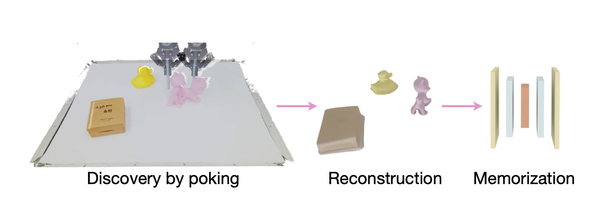

# Perceiving Unseen 3D Objects by Poking (ICRA 2023)

This project contains the implementation of our ICRA 2023 paper [arxiv](https://arxiv.org/abs/2302.13375).

Authors: Linghao Chen, Yunzhou Song, Hujun Bao, Xiaowei Zhou.




## Requirements

- Ubuntu 16.04+
- Python 3.7+
- Nvidia GPU with mem >= 12G
- GCC >= 4.9
- PyTorch >= 1.10.0

## Install
```bash
# Clone repo
git clone https://github.com/zju3dv/disprcnn.git
# Install conda environment
conda create -n puop python=3.7
conda activate puop
conda install pytorch=1.10.0 torchvision cudatoolkit=10.2 -c pytorch
pip install -r requirements.txt
conda install -c fvcore -c iopath -c conda-forge fvcore iopath -y
conda install pytorch3d -c pytorch3d -y
sh build_and_install.sh
```

## Training and evaluation
See [TRAIN_VAL.md](docs/TRAIN_VAL.md)

## Citation

If you find this code useful for your research, please use the following BibTeX entry.

```
@inproceedings{chen2023poking,
  title={Perceiving Unseen 3D Objects by Poking},
  author={Chen, Linghao and Song, Yunzhou and Bao, Hujiun and Zhou, Xiaowei},
  booktitle={ICRA},
  year={2023}
}
```


## Copyright
This work is affiliated with ZJU-SenseTime Joint Lab of 3D Vision, and its intellectual property belongs to SenseTime Group Ltd.

```
Copyright SenseTime. All Rights Reserved.

Licensed under the Apache License, Version 2.0 (the "License");
you may not use this file except in compliance with the License.
You may obtain a copy of the License at

    http://www.apache.org/licenses/LICENSE-2.0

Unless required by applicable law or agreed to in writing, software
distributed under the License is distributed on an "AS IS" BASIS,
WITHOUT WARRANTIES OR CONDITIONS OF ANY KIND, either express or implied.
See the License for the specific language governing permissions and
limitations under the License.
```

